# HCO — Logo brief v2: The mountain, measured

_Logo brief v2: a new symbol, palette and background system for HCO — High Country Observations._

**Status:** Draft for approval · 2 October 2026 · Supersedes the Stage 1 symbol recommendation if approved; naming and font licensing are still open.

## 1. The ask

1. A coloured or conceptual background as part of how the identity is seen.
2. The colour palette carried into the logo itself.
3. Digitised mountains as the background image.
4. A minimalist, pixel-style symbol that reads as data mapped onto terrain. The mountain can come back.

**What still holds**

- HCO is a practical advisory business for farmers, ranchers and agricultural operators: business and operations as well as field and property intelligence. It is not a drone vendor, an outdoor label or a luxury brand.
- The mark works flat, in one colour, at 16 px and with no background behind it.
- No invented data, clients, results or locations. Terrain imagery is real and attributed, or labelled illustrative.
- Still open from Stage 1: “Group” or “Consulting”, and font licensing.

> **The tension.** The original brief warned against mountains, dramatic imagery and effects. This direction brings all three back. It works only if the mountain arrives as data rather than scenery: measured, gridded, flat and honest. If a design on this brief looks like an outdoor brand or a drone start-up once it is placed on terrain, it has failed.

## 2. Reading the references

### HCO Identity Study 01

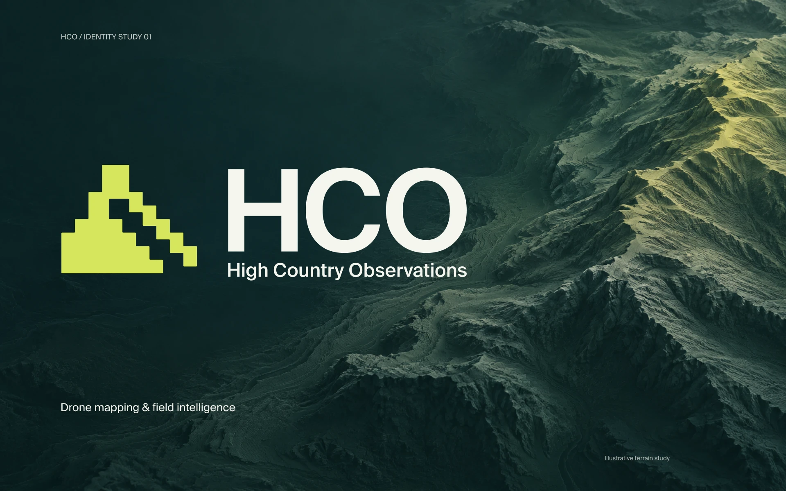

**Measured:** Symbol lime #D6E65D on a deep field #0C2425; wordmark #F5F6EE. Symbol ≈ 20 × 16 modules (a 16.5 px module at 1920 px wide). Left flank steps two modules wide; right flank one module. A one-module outer ridge, separated by a stepped channel.

**Take**
- One bright data colour on a deep field: strong figure and ground, and a clean break from green and gold.
- Terrain as atmosphere behind a flat mark.
- The honest caption: “Illustrative terrain study”.

**Leave**
- A pixelated peak beside initials is still the category's most common mark, now in 8-bit.
- Mixed step sizes break the grid's own logic.
- At 16 px a module is 0.8 px: the ridge and channel blur into one shape (test, left).
- The photoreal render is dramatic and dark, closer to adventure or tech than to advice.
- “Drone mapping & field intelligence” describes half the business.
- The wordmark is an unaltered neutral grotesk.

Small-size test (symbol cropped from the study and resampled): 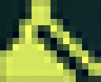 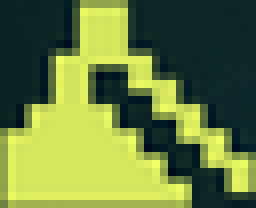

### MetaLine

- **Take:** One notch detail, repeated with discipline, gives a simple shape a signature.
- **Leave:** Slanted speed strokes and gradient backgrounds: logistics and fintech shorthand.

### Stepped bars

- **Take:** Maximum economy: two shapes and one step, legible at any size. The step reads as a terrain section and as a change in data.
- **Leave:** Alone it has little to own, and it sits close to the earlier Rise route.

### requiem

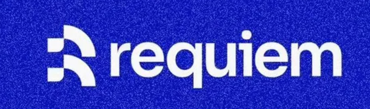

- **Take:** A letter built from the symbol's own modules, so mark and name share one geometry. A saturated field with fine grain, while the logo stays flat.
- **Leave:** The arc vocabulary, and grain inside the logo.

### Pixel ring

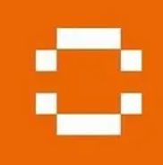

- **Take:** The fewest cells that still make a form: eight. Generous cells stay legible. And it is an O — HCO's own letter.
- **Leave:** Anything that tips into 8-bit game nostalgia: small cells, many cells, sprite-like figures.

_Brace (logosystem.co/logo/brace) could not be opened: the site is blocked from this environment. Paste a screenshot and it will be added to this analysis._

### What the references agree on

1. **One module.** Every cell the same size. No half-cells, rounding or mixed steps.
2. **Few cells.** The strongest references use 8–20 cells. The weakest move is detail.
3. **Flat mark, rich field.** Colour and texture live in the background. The mark stays flat.
4. **One signature.** A notch, a step or one flagged cell — never several.

_The reference images in `refs/` are third-party work, kept for internal discussion only. Never publish or adapt them._

## 3. The idea: The mountain, measured

A mountain isn't drawn; it's sampled. Drone surveys and elevation models turn land into a grid of measured cells — rasters of height, crop health and change. HCO's work makes the same move: a great deal of observation, reduced to the few cells that matter.
The symbol is the high country at the coarsest honest resolution: terrain sampled into a handful of cells, with colour encoding value. The background is the same terrain at full resolution. Logo and background are one dataset at two scales — the observation, and the judgement.

**Key finding.** Sample from above, not from the side. Side-on, any mountain sampled to eight columns becomes a ziggurat (the silhouette) or a bar chart (a single section). Sampled from above, the way a drone sees it, the same terrain becomes a diagonal of cells with one summit: specific, asymmetric and much harder to mistake for a stock peak.

Principle diagrams (procedural terrain, not logo proposals): side view 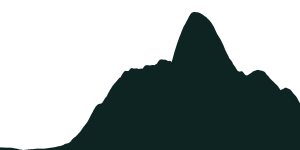 → 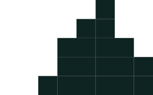 · section 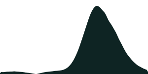 →  · plan view 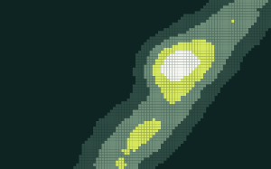 → 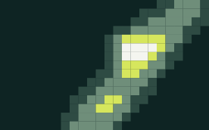 → 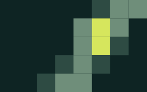

## 4. Requirements

### Symbol

- **Grid.** One square module. The symbol grid is no larger than 8 × 8, so a module is at least 2 px when the symbol is 16 px.
- **Cells.** 8–24 filled cells. No half-cells, rounded corners, outlines, gradients or effects inside the mark.
- **Source.** Sampled from terrain, preferably top-down. Asymmetric and specific — never a symmetrical stepped triangle.
- **Colour.** Up to four ramp values, always in the same order (low → high), plus at most one Flag cell for the observation.
- **One colour.** Must also work with every cell in one colour, in Basalt and in Chalk.
- **Must not resemble.** A ziggurat or pyramid, a game sprite or block game, a bar chart or growth staircase, a QR code, four-pane window tiles, a chequered flag or a crosshair.
- **Small sizes.** Tested at 16, 24 and 32 px. A simplified 16 px cut is allowed only if it keeps the same idea.

### Wordmark

- **Name.** HCO, with “High Country Observations” as the expanded name; “Consulting” optional until naming is confirmed.
- **Measure.** Wordmark stem width = one symbol module; symbol height = cap height or a whole number of modules.
- **W1 · High Bar.** Carry the raised crossbar onto the grid: it fills the sixth of eight rows (centre at 68.75%, close to Stage 1's 71.5%).
- **W2 · Grid-built.** HCO drawn on the symbol's module with straight stems and squared counters — readable, and never a pixel font.
- **Not.** An unaltered neutral grotesk (Study 01), or any bitmap or pixel typeface.

## 5. Colour: the palette is a data ramp

| Role | Name | HEX | Use |
|---|---|---|---|
| Core | Basalt | `#0E2423` | The field. Dominant, about 60%. Developed from Study 01's #0C2425, slightly more mineral. |
| Core | Chalk | `#F4F5EF` | Type and light ground, about 25%. A crisp neutral, not cream. |
| Core | Lichen | `#D6E65D` | The signal: the highest value in every ramp, about 10%. Inherited from Study 01. |
| Core | Flag | `#EC5D2F` | The observation: one cell, one marker, one call-out. Under 3%. Survey flagging-tape orange. |
| Ramp tint | Moss | `#2E4B43` | Ramp, low |
| Ramp tint | Sage | `#6F8E7A` | Ramp, mid |

**Measured contrast (WCAG 2.x)**

| Foreground on background | Ratio | Use |
|---|---|---|
| Chalk on Basalt | 14.79:1 | text (AA) |
| Lichen on Basalt | 11.84:1 | text (AA) |
| Flag on Basalt | 4.77:1 | text (AA) |
| Sage on Basalt | 4.5:1 | text (AA) |
| Moss on Basalt | 1.7:1 | not for text or marks |
| Flag on Chalk | 3.1:1 | large text and graphics |
| Sage on Chalk | 3.29:1 | large text and graphics |
| Lichen on Chalk | 1.25:1 | not for text or marks |

_Lime on near-black has been a tech and fintech staple since 2024. It photographs well but dates quickly; test a more mineral alternative before locking Lichen._

**Rules**
- The full-colour symbol sits on Basalt. On Chalk, use the one-colour Basalt symbol: Lichen on Chalk measures 1.25:1.
- The ramp order never changes: Moss → Sage → Lichen → Chalk means low → high. The same ramp colours HCO's maps and reports, so the logo teaches people to read the data.
- Flag never decorates. It marks something someone should look at.
- No gradients, and no green and gold.

## 6. Background: digitised mountains

- **A · Pixel heightmap.** Cells coloured by the ramp: the symbol at full resolution. 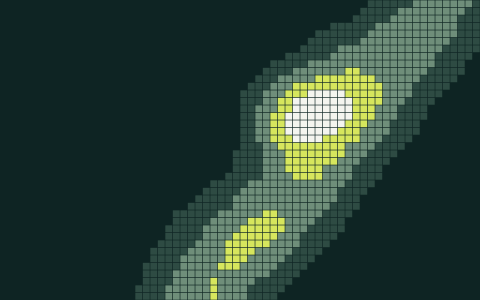
- **B · Dot matrix.** Dot size encodes elevation; a halftone that stays quiet behind type. 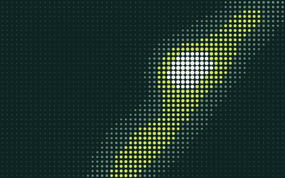
- **C · Quantised hillshade.** Relief posterised into five tones of the field colour; the quietest option. 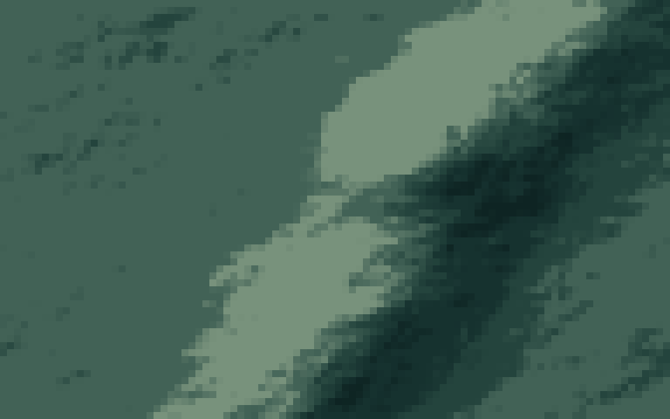

**Data.** Use real elevation data — Copernicus DEM GLO-30 (free, attribution required) or USGS 3DEP (public domain) — from a region the client confirms. Until then, use procedural terrain labelled “Illustrative terrain study”. No place names, coordinates or scale bars unless they are real and confirmed.

**Rules**
- The background never carries the logo's meaning; the logo must stand without it.
- Keep a quiet zone behind the logo, inside its clear space.
- Text over terrain measures at least 4.5:1 against the busiest area beneath it.
- Show terrain at a legible data resolution: no blur, glow, depth of field or cinematic lighting.

**Avoid:** Photoreal dramatic renders · neon wireframes and HUD overlays · contour wallpaper · stacked ridgelines (the “Unknown Pleasures” cover) · crosshairs and random coordinates · fake data labels.

## 7. This round

### Deliverables
1. **Three symbol studies.** S1 Plan raster: terrain from above, ≤ 8 × 8, ramp-coloured. S2 Plan raster with one Flag cell. S3 the best side-view sample, tested against the ziggurat and bar-chart traps. Each in full colour on Basalt, one colour in Basalt and Chalk, reversed, at 16/24/32 px, with its construction grid.
2. **Two wordmarks.** W1 High Bar on the grid; W2 grid-built.
3. **Palette.** Final values with a measured contrast table.
4. **Background.** Two render modes, on illustrative or confirmed elevation data.
5. **Presentation.** Three identity studies in the Study 01 format (logo on terrain), plus every logo flat on Chalk with no background.
6. **Recommendation.** An evaluation, and one recommended route.

### How we'll judge it
- Reads as terrain or data within five seconds — not a game, a pyramid, a chart or a staircase.
- Holds at 16 px, with a module of at least 2 px.
- Works in one colour and with no background.
- Looks like an advisory practice for farms and ranches, not a drone vendor or an outdoor brand.
- Uses the palette as a data ramp, consistently.
- Passes a recorded resemblance check against existing pixel-mountain and pixel-grid marks (not trademark clearance).

### Open questions
1. Brace: please paste a screenshot; the link is blocked here.
2. Study 01: who produced it, and are its lime and deep green the intended starting palette?
3. Terrain: real elevation data from a region you confirm, or illustrative?
4. Wordmark: keep High Bar, or rebuild on the grid?
5. Descriptor: Study 01's “Drone mapping & field intelligence” covers half the business. Use the two service areas instead?
6. Still open: “Group” or “Consulting”, and font licensing.
